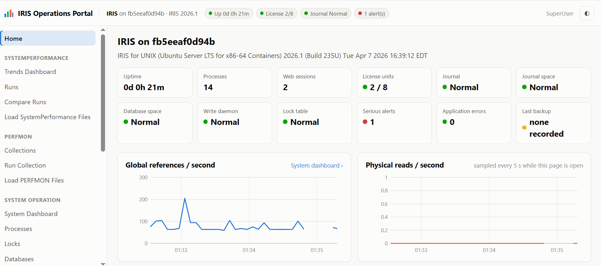
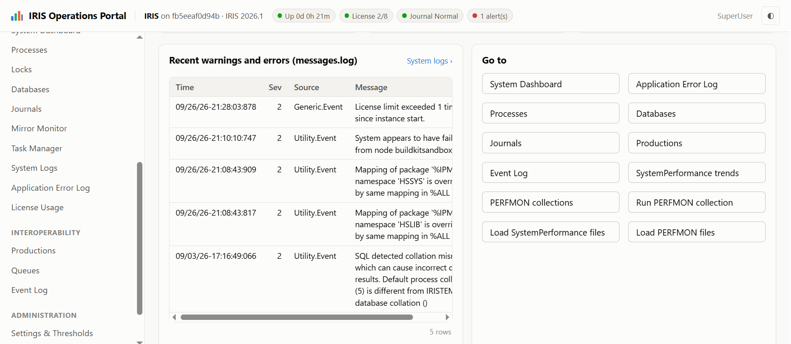
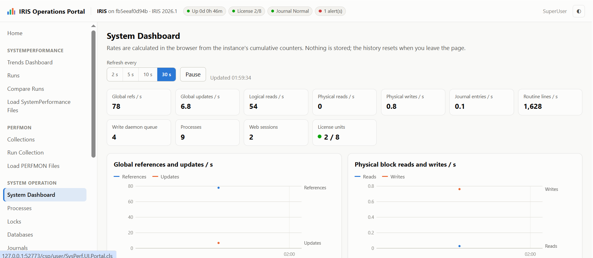
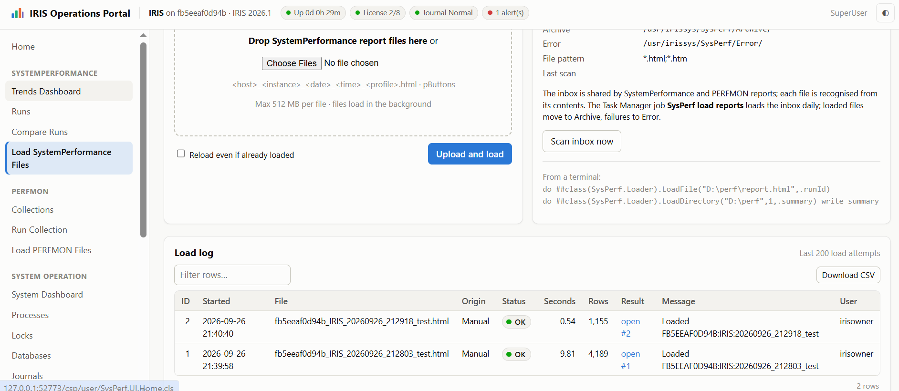
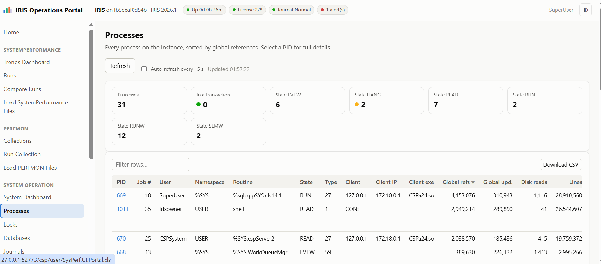
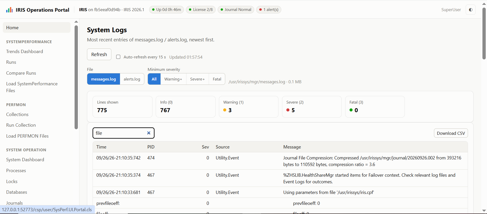
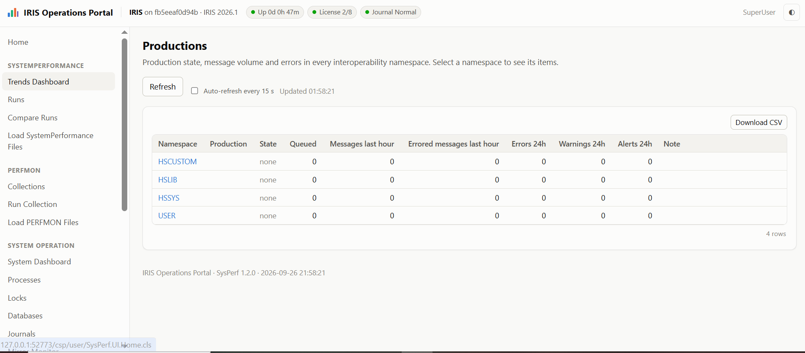
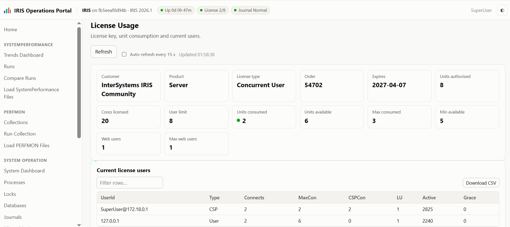
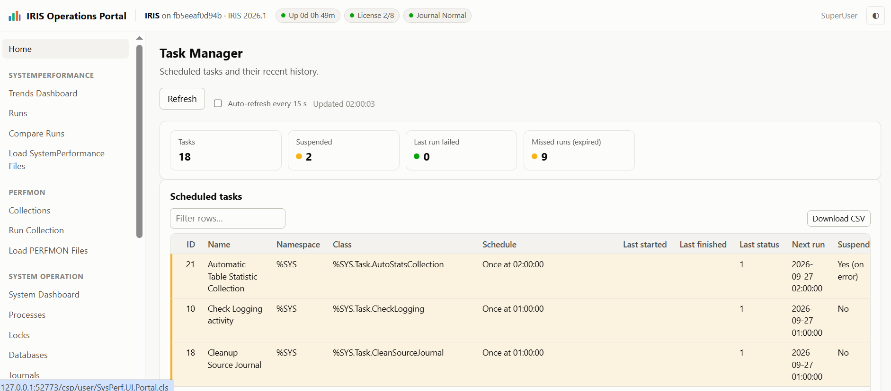

# SysPerf: IRIS Operations Portal (SystemPerformance, PERFMON, live operations)




SysPerf is a set of classes only (no external libraries, no CDN). It has three parts, all reached from one portal with a management-portal style sidebar (`SysPerf.UI.Portal.cls`):

* **SystemPerformance analytics.** It loads every ^SystemPerformance / ^pButtons HTML report into persistent classes and runs an analyzer that raises bottlenecks with recommendations. You get day / week / month / custom trends and can drill into every section of every report.


* **PERFMON analytics.** It runs PERFMON timed collections from the portal or from Task Manager, and loads existing PERFMON HTML reports. Every table goes into persistent classes, and an analyzer names the globals, routines, processes and databases that drive the load.
* **Live operations** for the local instance: a system dashboard, processes, locks, databases, journals, mirror, Task Manager, system logs and license. There are also **interoperability** views: productions and their items, queues and the event log across every interoperability namespace. All of these views are read-only.

Tested on **InterSystems IRIS for Health 2026.1 (Build 235U)**, the same build as your UAT server. It was tested with your Windows report and with a Linux report generated on the same build. The classes use standard %CSP, %SQL, %DynamicObject and %SYS.Task APIs (IRIS 2021.1+).

---
---

## 1. Install (about 5 minutes)

Run the install from a terminal as a user with `%All`, or with `%Admin_Manage` plus `%Admin_Secure`.

```objectscript
// 1) (optional, recommended) dedicated namespace + database on a data drive
zn "%SYS"
// import once anywhere to get the installer, or create the namespace in the Portal
do $system.OBJ.Load("D:\install\SysPerf.xml","ck")        // e.g. into USER
do ##class(SysPerf.Installer).CreateNamespace("SYSPERF","D:\IRISDB\sysperf\")

// 2) load + compile into the target namespace
zn "SYSPERF"
do $system.OBJ.Load("D:\install\SysPerf.xml","ck")

// 3) security, web application, task, folders, thresholds
do ##class(SysPerf.Installer).Setup("/csp/sysperf","D:\SysPerf\Inbox\",6)
//            web app path ----^      inbox folder ----^           ^-- daily task hour (-1 = none)
```

`Setup()` is idempotent, so you can re-run it after an upgrade. It creates:

* **Resources:** `SysPerf_Viewer` and `SysPerf_Admin`.
* **Roles you assign to users:**
  * `SysPerfViewer`: read-only access to every screen.
  * `SysPerfAdmin`: upload, acknowledge findings, notes, settings, delete runs and collections, start PERFMON collections.
* **Roles the web application adds automatically** (MatchRoles). Users never hold them outside the portal:
  * `SysPerfPortal` is added to every portal user. It grants `%DB_IRISSYS:R` and `%Admin_Operate:U`, Read on the globals database of every namespace (for the application error log) and on the routine database of every interoperability namespace, plus SQL SELECT/EXECUTE on the system tables used. The live views need this.
  * `SysPerfCollector` is added only to `SysPerfAdmin` users. It grants `%DB_IRISSYS:RW`, which PERFMON requires in order to run.
* **Database access:** both roles include RW on the namespace's database resource and the matching SQL grants (`SELECT` for viewers, full DML for admins).
* **Web application:** `/csp/sysperf`, password authentication, requires `SysPerf_Viewer`.
* **Tasks:**
  * *SysPerf load reports (SYSPERF)*, daily at 06:00.
  * *SysPerf PERFMON collection (SYSPERF)*, weekdays at 10:00 for 300 s. This task is created **suspended**; resume it in Task Manager to collect regularly.
  * Both tasks run as `_SYSTEM`. Change the user in Task Manager if your policy requires it; the PERFMON task user needs `%DB_IRISSYS:RW`.
* **Folders:** Inbox / Archive / Error, and the analyzer threshold table.

Assign the roles to users in **System Administration > Security > Users**.

Open **`https://<server>:<port>/csp/sysperf/SysPerf.UI.Portal.cls`**. This is the portal home, and every screen is reachable from its sidebar.

> **New namespace later?** Run `do ##class(SysPerf.Installer).SetupPortalRole()` so the portal can read its application errors and, for interoperability namespaces, its productions.

> **Web gateway upload limit.** 24-hour reports are 50–150 MB. If uploads fail with HTTP 413 or the connection resets, raise the request size limit of your web server (IIS `maxAllowedContentLength`, Apache `LimitRequestBody`), or use the inbox folder instead.

---

## 3. Feeding reports

Duplicates are detected automatically: by SHA-256 of the file, and by `Host:Instance:RunId`.

| How | Details |
|---|---|
| **Upload in the UI** | *SystemPerformance > Load SystemPerformance Files* page. Drag-drop one or more `.html` files. They load in a background job and the log refreshes every 3 s. There is a "Reload even if already loaded" option. |
 


| **Inbox folder + task** | Copy reports into the inbox (e.g. a scheduled copy of each server's `mgr\*.html`). The daily task loads them, moves them to Archive or Error, and purges runs older than the retention period. The task fails visibly in Task Manager if a file could not be loaded. `IncludeMgrDirectory=1` on the task also picks up this instance's own daily reports from `mgr`. |
| **Terminal / your own code** | `do ##class(SysPerf.Loader).LoadFile("D:\perf\x.html",.runId)`<br>`do ##class(SysPerf.Loader).LoadDirectory("D:\perf\",1,.summary) write summary` |

**Collect a report every day:** set CPF `[Startup] SystemPerformanceDailyReportsOn=1`, or schedule `do run^SystemPerformance("24hours")` in Task Manager on each server. Then point the inbox at the output.

**Windows perfmon:** your sample's perfmon section failed with *"Access is denied"* (`logman`). Run the profile as a local administrator, or add the IRIS service account to **Performance Log Users** and restart IRIS. Without perfmon there is no CPU, memory or disk time-series; the analyzer flags this.

---

## 4. What is stored (every section → persistent classes)

| Report section | Class / table (`SysPerf_Data.*`) | Granularity |
|---|---|---|
| Header, Configuration, Profile, debug snapshot | `Run` (+ `KeyValue`) | one row per report: host, instance, version, CPUs, RAM, global/routine buffers, block size, large pages, VM, run window, collector errors, health score |
| mgstat (all 38 columns; new columns go to `Extra`) | `Mgstat` | every sample, plus derived cache-hit % |
| perfmon (every counter) | `OSColumn` + `OSSample` (raw) → `OSStat` + `DiskStat` (normalised) | every sample, every counter, per core, per disk |
| vmstat / iostat / sar -u / sar -d / free | same as above | every sample; per device for iostat / sar -d |
| %SS | `Process` + `ProcessDelta` | every process in every snapshot; per-process activity between snapshots |
| irisstat -c1 PIDTAB + job summary | `IRISJob` | every job per sample: state, physical/logical reads, routine, namespace, client IP |
| irisstat -c1 GFILETAB | `DatabaseFile` | every database per sample: size, max, flags, journaled, read-only |
| irisstat -c1 / -D resource tables | `ResourceStat` | seize / Nseize / Aseize / Bseize counts, %, per-second rates, block collisions |
| irisstat -c1 other blocks (header counters, write daemon, journaling, routine stats, global counters, async I/O, error log) | `KeyValue` | per sample |
| irisstat -R | `RoutineBuffer` (+ `KeyValue`) | every routine buffer in use |
| CPF file | `ConfigParam` | every `[Section] Name=Value` |
| License, IRIS ALL, Windows info, `<distro> info`, cpu/lscpu, sysctl, ipcs, df | `KeyValue` | every line |
| tasklist / ps | `OSProcess` | every OS process per sample |
| every section (raw text) | `ReportSection` (stream) | the "Report text" tab shows the original text |
| analyzer | `Finding` | severity, category, evidence, peak periods, recommendation, acknowledgement |
| roll-ups | `HourlyStat` | count / avg / min / max / p95 per metric, hour and device; drives the day / week / month views |

Configuration: `SysPerf.Config.Settings` (folders, retention, upload size) and `SysPerf.Config.Threshold` (rules). Audit: `SysPerf_Data.LoadLog`. CSV export of any table: `SysPerf.UI.Export.cls?id=<run>&t=<Table>`.

---

## 5. Screens

* **Dashboard:**
  * System selector and Day / Week / Month / Month-to-date / 90 days / Year / Custom periods, anchored to the latest data.
  * Hourly or daily granularity.
  * KPIs with change vs the previous period.
  * CPU, global refs/updates, physical reads/writes, cache hit, worst disk latency, memory, journal/WIJ, write daemon queue, routine loads and IRIS processes.
  * "Explore any metric", including per-device disk metrics.
  * A day-of-week × hour heatmap to see when the system is busiest.
  * Health score per run, recurring findings, database growth, the run list and a CSV of hourly data.
  
  
  
  
  

* **Runs:** filter, compare two runs, re-analyse, delete (admin).
* **Run detail:** 15 tabs.
  * Findings: severity filter, evidence, recommendations, acknowledge.
  * System summary and notes.
  * mgstat: a chart for every counter with min/max band, a stats table for all counters, full data.
  * OS: CPU, run queue, memory, paging, network, disk, per source.
  * Disks: per-device averages and charts.
  * Processes: busiest processes, activity table, every %SS snapshot.
  * IRIS jobs: physical reads by job, job states.
  * Contention: resource seizes over time, contention %.
  * Databases.
  * Configuration: key parameters and full CPF.
  * All details: every KeyValue.
  * OS processes, routine buffers.
  * Raw OS counters: chart any perfmon/vmstat/iostat/sar column.
  * Report text.
* **Compare:** key metrics side by side with Δ%, an overlay on elapsed minutes, findings new/resolved/changed, CPF differences.
* **Load SystemPerformance Files** (upload, inbox scan, load log). **Admin** (settings, editable thresholds, maintenance, storage).

---

## 6. Analyzer rules

All thresholds can be edited on the Admin page; re-analyse to apply them to existing runs. Each finding lists evidence, the peak time, **the periods above the threshold** (e.g. `09-22 13:00-15:59 (180 min, peak 35.9 at 14:50)`) and a concrete recommendation.

| Area | Rules |
|---|---|
| **CPU** | avg / p95 busy, busiest single core, I/O wait, steal, run queue per core |
| **Memory** | lowest available % of RAM, commit %, hard paging, swap, page file, virtual memory |
| **Disk** | worst device read/write latency, p95 spikes, queue, utilisation, file systems % full |
| **Global buffers** | cache hit %, physical reads/s, size vs RAM (too small or too large), globals=0 (automatic) |
| **Routine / heap** | routine loads/s, routines=0, gmheap, locksiz |
| **Write daemon** | % of samples active, max queue, WIJ expansion failures / IJ panic |
| **Journal** | writes/s, journal / WIJ / databases on the same volume, alternate = primary, FreezeOnError, purge |
| **Database** | near max size, IRISTEMP size, expansion/s, growth during the run, application DBs not journaled, databases on C: |
| **Contention** | Nseize/Aseize/Bseize %, block collisions |
| **Processes** | busiest process share of global references, process counts |
| **License / HA / IRIS** | evaluation / no key, license usage, no mirror, kernel error log, ECP, daily reports off, messages.log size, large pages |
| **Linux / VM** | huge pages, swappiness, dirty ratios, VM guidance, uptime |
| **Collection** | collector failures (perfmon access denied), run too short for capacity analysis |

Health score = 100 − 15 × critical − 5 × warning.

---

## 6a. The portal

| Sidebar group (in this order) | Screens |
|---|---|
| **Home** | Instance status tiles (uptime, processes, sessions, license, journal, database space, write daemon, lock table, alerts, application errors, last backup, mirror). Live global refs/s and physical reads/s. Latest SystemPerformance run and PERFMON collection with health score. Production states and recent severe messages.log entries. |
| **SystemPerformance** | Trends Dashboard, Runs, Compare Runs, **Load SystemPerformance Files** (upload, inbox scan, load log of SystemPerformance files only). |
| **PERFMON** | Collections (list and trends), Run Collection, **Load PERFMON Files** (upload, inbox scan, load log of PERFMON files only). |
| **System Operation** | **System Dashboard:** rates from the cumulative SYS.Stats counters, refreshed every 2–30 s, plus every dashboard status. **Processes:** every process, with a PID drill-down; only the columns that exist in your IRIS version are queried. **Locks.** **Databases.** **Journals.** **Mirror Monitor.** **Task Manager:** tasks, failures, missed runs, history. **System Logs:** messages.log / alerts.log with a severity filter. **Application Error Log:** ^ERRORS of every namespace (see below). **License Usage.** |
| **Interoperability** | **Productions** with their items, **Queues**, **Event Log**. |
| **Administration** | Settings & Thresholds (admins only). |

**Application Error Log.** This shows the same data as *System Operation > System Logs > Application Error Log* in the Management Portal, for all namespaces on one screen. You can filter by period (today / 7 / 30 days / all) and namespace, and there are errors-per-day and most-frequent-error charts. Select an error number to see the full detail: process state and variables, objects, devices and stack. It is read-only; errors are purged as usual in the Management Portal.

**Two load pages, one inbox.** Each load page accepts only its own report type. A PERFMON file uploaded on the SystemPerformance page is rejected with a pointer to the right page, and the reverse also applies. The inbox folder and the daily task stay shared, and each file is recognised from its contents.

Every table can be filtered, sorted and downloaded as CSV. The top bar shows status chips (uptime, license, journal, alerts, mirror), and there is a light / dark theme. On phones the sidebar collapses into a menu.

## 6b. PERFMON

**Ways to get data in**

| How | Details |
|---|---|
| **Run collection** (PERFMON > Run collection, admin only) | Choose 10 s – 60 min. A background job runs `$$Collect^PERFMON(seconds,"HTML",file)` in %SYS, saves `PERFMON_<instance>_<time>.html` in the archive folder, loads it and analyses it. The page shows progress and then links to the analysis. Only one collection can run at a time. If the monitor is already running (someone started PERFMON by hand), the request is refused rather than disturbing it, and a failed request never leaves the monitor running. |
| **Task Manager** | `SysPerf.Task.PerfmonCollect` (property *Seconds*). The installer creates a suspended instance of it. |
| **PERFMON > Load PERFMON Files** | Upload one or more PERFMON_*.html files from any server. They load in the background, with a load log of PERFMON files. |
| **Inbox / terminal** | Drop the files into the shared inbox, or run `do ##class(SysPerf.PM.Loader).LoadFile("D:\perf\PERFMON_x.html",.id)`. |

**What is stored** (`SysPerf_PM.*`)

| PERFMON table | Class | Notes |
|---|---|---|
| Header (configuration, host, duration, time, table list) | `Collection` | One row per report, with totals, per-second rates, health score, notes and the original HTML (when *Keep raw sections* is on). Duplicates are detected by file hash and by `HOST:CONFIG:time`. |
| Global metrics per Global | `GlobalStat` | Refs, % refs, sets, kills, blocks allocated, journal entries, physical reads / writes, logical reads, miss %, database, directory, and a per-second rate for each |
| Global metrics per Routine | `RoutineGlobal` | Same metrics per routine. `%sqlcq` and generated routines are resolved to SQL / class. |
| Routine metrics per Routine | `RoutineStat` | Lines, % lines, loads, fetches, lines per load |
| Routine / Global metrics per Process | `ProcessStat` | Both tables merged per PID with process-list details and ranks |
| Process List | `Process` | Columns are matched by header name. Values are type-checked: a value that does not fit its column (for example an IP address in a Yes/No column, which some IRIS versions and ECP processes produce) is kept in `Extra` instead of failing the load. Rows whose cell count differs from the header also keep the raw row, and unparseable rows go to `GenericRow`. |
| any other table | `GenericRow` | Header and cells are kept, so nothing is lost |
| analyzer | `Finding` | With acknowledgement. A forced reload keeps acknowledgements and notes. |

**Analyzer rules** (thresholds are editable on the Admin page)

| Code | What it detects |
|---|---|
| `PM_HOT_GLOBAL` | One global takes 25 % / 50 % of all references |
| `PM_GLOBAL_PHYRD` | Physical reads/s per global (500 / 2000). It detects sequential scans (physical > logical) and lists the routines responsible. |
| `PM_GLOBAL_JRN`, `PM_GLOBAL_UPD` | Journal entries and updates/s per global. It flags transient / temporary globals that should not be journaled. |
| `PM_BLKALLOC` | Block allocation/s (database growth), with an IRISTEMP variant |
| `PM_SQL_TEMP` | Share of SQL temp / sort globals |
| `PM_COMPILE`, `PM_DICT_REFS` | Class dictionary globals updated (compiles in production) or referenced heavily |
| `PM_HOT_ROUTINE`, `PM_SQL_LINES`, `PM_RTN_LOADS` | Routine hot spots, SQL share of lines, routine buffer loads/s |
| `PM_PROC_SHARE`, `PM_LOCK_WAIT`, `PM_STATES` | One process dominating, processes waiting on locks, process states |
| `PM_DB_HOTSPOT` | Database carrying most of the physical I/O |
| `PM_SHORT`, `PM_SUMMARY` | Collection too short to be representative, and a summary |

**Screens**

* **Collections:** list, delete and re-analyse.
* **Trends** across collections: refs/s, physical reads/s, journal/s, lines/s, health, and the hottest globals over time by references, physical reads, updates or journal.
* **Collection detail**, with tabs for findings, globals, globals by routine, routines, processes, databases, process list, other tables, notes and the original report (in a sandboxed frame). There are top-12 charts on every tab, and previous / next collection navigation.
* CSV of any PERFMON table: `SysPerf.UI.Export.cls?id=<collection>&t=PM.GlobalStat` (also `PM.RoutineGlobal`, `PM.RoutineStat`, `PM.ProcessStat`, `PM.Process`, `PM.Finding`).

---

## 7. Security

* All pages require `SysPerf_Viewer` (via `SECURITYRESOURCE`). Admin actions check `SysPerf_Admin` on the server.
* CSRF token on every POST.
* Output is HTML-escaped on the server. The browser only inserts data with `textContent`.
* JSON endpoints are read-only, use parameterised SQL, and whitelist tables and columns.
* Uploads accept `.html`/`.htm` only. File names are sanitised and size is capped.
* The report parser **never executes report content**; the `$lb()` debug snapshot is parsed with a safe tokenizer.
* CSV export neutralises spreadsheet formulas.
* Security headers are set: `X-Frame-Options`, `nosniff`, `no-store`. The original PERFMON report is served with `Content-Security-Policy: sandbox` inside a sandboxed iframe, so its content cannot run scripts.
* **Live and interoperability views are read-only.** They only use documented system classes and queries, and there is no kill / suspend / purge button. The extra privileges (`SysPerfPortal`, `SysPerfCollector`) exist only inside the portal's web application.
* Starting a PERFMON collection is checked on the server (`SysPerf_Admin` plus CSRF) and validated (10–3600 s, one at a time).

---

## 8. Operations

* **Re-analyse after changing thresholds:** Admin page, or `do ##class(SysPerf.Loader).Reanalyze()`.
* **Retention:** `Settings.RetentionDays` (default 400). The task purges older runs, and marks stale loads (> 1 day) as failed.
* **Size:** a 24-hour report at 10 s intervals with perfmon adds about 150k rows and loads in about 7 s. A 2 s interval takes about 35 s in a background job.
* **Unit tests:** `do ##class(SysPerf.Test.Core).Run("D:\sysperf\samples\")`. The folder must contain `win_sample.html` / `linux_sample.html`, and optionally `perfmon_sample.html` for the PERFMON tests.
* **PERFMON overhead:** a collection adds a small overhead while it runs, so prefer 1–5 minute collections at the busy hour. The files are about 0.5–2 MB.
* **Uninstall:** `do ##class(SysPerf.Installer).Uninstall("/csp/sysperf")` removes the web app, both tasks and the four roles, and keeps the data. Delete the namespace to remove everything.
* **Licensing note:** each browser session uses a license unit like any CSP application.
